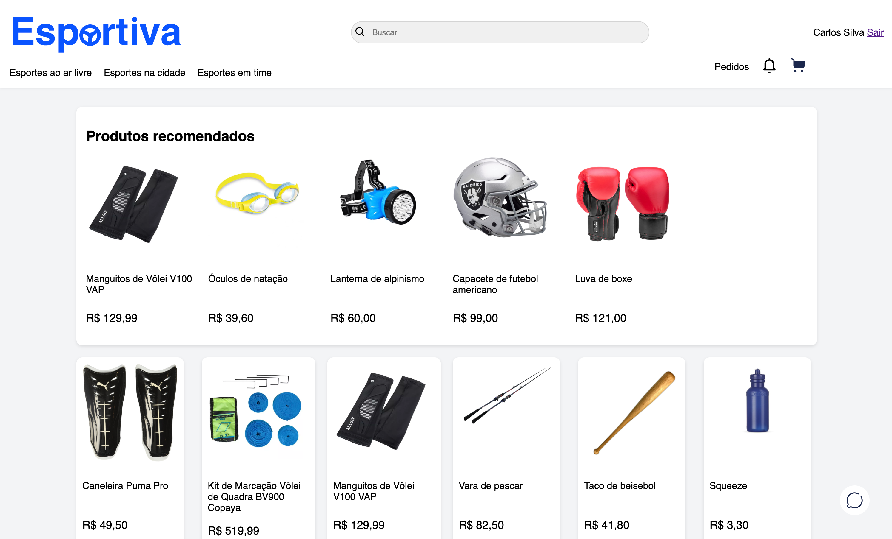
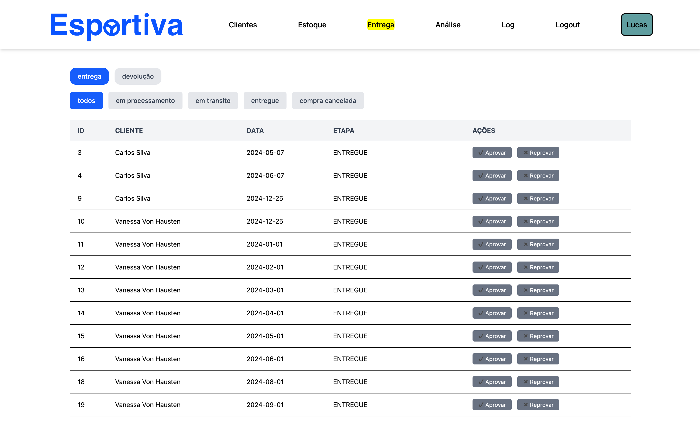
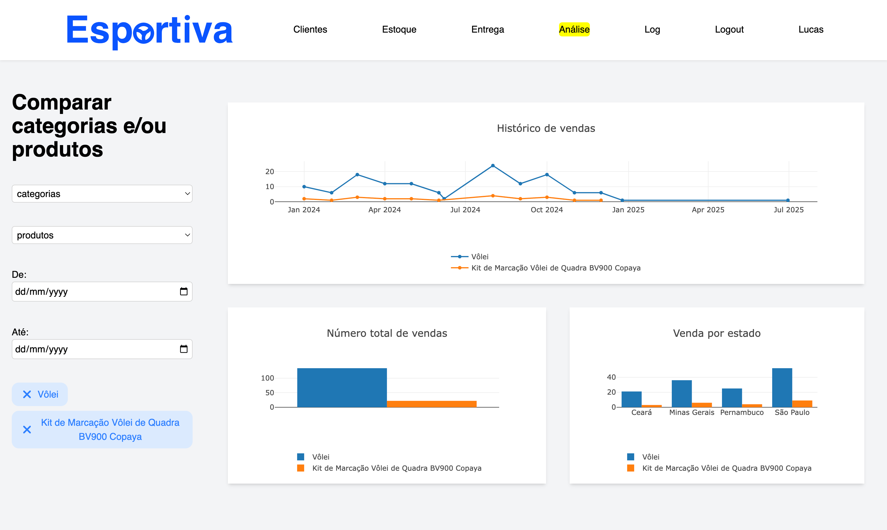
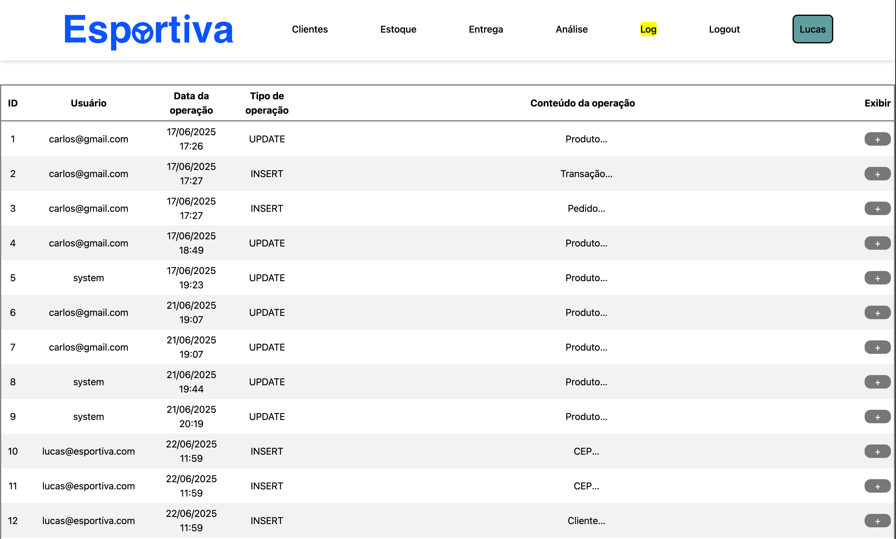

# Esportiva

# Índice

- [Descrição](#descrição)
- [Funcionalidades](#funcionalidades)
- [Telas Principais](#telas-principais)
- [Tecnologias utilizadas](#tecnologias-utilizadas)
- [Estrutura do Projeto](#estrutura-do-projeto)
- [Como rodar o projeto](#como-rodar-o-projeto)
- [Melhorias](#melhorias)

# Descrição

Projeto feito seguindo os requisitos pedidos pelo professor de Laboratório de Engenharia de Software e consiste em um ecommerce de artigos esportivos

# Funcionalidades

## usuário

- Produtos recomendados baseado no histórico
- Chatbot
- Compra de Produtos
- Carrinho
- itens são reservados quando vão para o carrinho
- itens são liberados do carrinho após 30 minutos

## administrador

- gerenciar estoque
- gerenciar clientes
- gerenciar fluxo de entrega e devolução
- ver logs de alterações
- Comparar categorias e produtos com base no quanto venderam (por tempo, estado, total)

# Telas principais

## Home



## Logística



## Análise de produtos e categorias



## Página de Log de alterações



[Video Demostração](https://jam.dev/c/34f6fd10-6602-491f-9968-7e241c66c46a)

# Tecnologias utilizadas

## backend:

- Java 23
- Spring
- Flyway
- Postgres
- Gemini Flash 2.0

## frontend:

- Thymeleaf
- Tailwind
- Alpine
- Plotly

## Testes
- Selenium
- JUnit

# Estrutura do projeto

Backend
```
├── EsportivaApplication.java
├── config # Regras de cargos por rota
├── controller 
├── dto
├── entity
├── exception
├── listeners # logs
├── mapper
├── repository
├── service
├── sheduledTasks # jobs assincronos (e.g remoção de itens do carrinho )
├── utils
└── validation
```

# Como rodar o projeto:

crie um .env seguindo o exemplo do [`.env.example`](./.env.example).

Rode o comando abaixo para criar um banco de dados postgres

```bash
  docker compose up -d
```

### Backend

O backend está configurado para rodar na porta 8080

```bash
    mvn clean install
    mvn spring-boot:run
```

acesse [localhost:8080](http://localhost:8080)

# Melhorias

- Migrar o frontend para um framework javascript para maior reusabilidade de componentes
- Refatorar arquitetura para usar domínios
